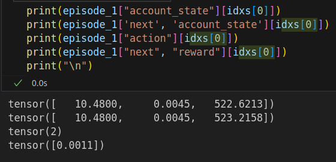
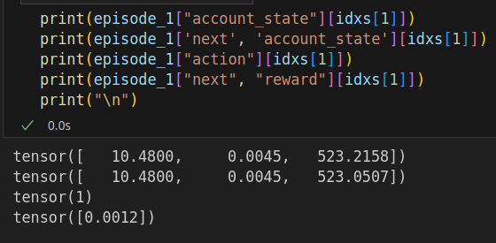
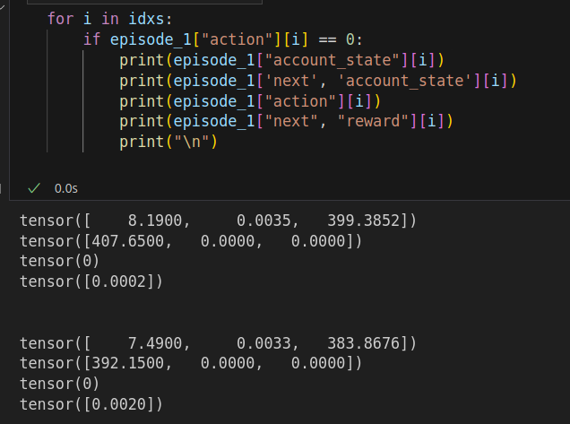

# First Live Deployment

Running a random agent to test the environment and gather some data.

### TLDR: 
Fixing the reward function as we were computing the reward as:

```python
    def _calculate_reward(
        self,
        old_portfolio_value: float,
        new_portfolio_value: float,
    ) -> float:
        """Calculate the step reward."""

        # Calculate portfolio return
        portfolio_return = (
            new_portfolio_value - old_portfolio_value
        ) / old_portfolio_value

        # Scale the reward
        reward = portfolio_return * self.config.reward_scaling

        return reward
```
Which included rewards for unrealized profits. However, we want to reward only realized profits aka portfolio gain when selling our position.


___________________________

## Observation Setup

```python

    total_farming_steps = 10000
    save_buffer_every = 10
    max_rollout_steps = 72 #  72 steps a 5min -> 6h per episode -> 4 episodes per day
    policy_type = "random"

    torch.manual_seed(42)
    np.random.seed(42)
    # Create environment configuration
    config = AlpacaTradingEnvConfig(
        symbol="BTC/USD",
        paper=True,
        time_frames=[
            TimeFrame(1, TimeFrameUnit.Minute),
            TimeFrame(5, TimeFrameUnit.Minute),
            TimeFrame(15, TimeFrameUnit.Minute),
            TimeFrame(1, TimeFrameUnit.Hour),
        ],
        window_sizes=[12, 8, 8, 24],  # ~12m, 40m, 2h, 1d
        execute_on=TimeFrame(5, TimeFrameUnit.Minute), # Try 15min
    )

```

## Feature Preprocessing Function
with the feature preprocessing function:

```python

def custom_preprocessing(df: pd.DataFrame) -> pd.DataFrame:
    """
    Preprocess OHLCV dataframe with engineered features for RL trading.

    Expected columns: ["open", "high", "low", "close", "volume"]
    Index can be datetime or integer.
    """

    df = df.copy().reset_index(drop=True)

    # --- Basic features ---
    # Log returns
    df["features_return_log"] = np.log(df["close"]).diff()

    # Rolling volatility (5-period)
    df["features_volatility"] = df["features_return_log"].rolling(window=5).std()

    # ATR (14) normalized
    df["features_atr"] = ta.volatility.AverageTrueRange(
        high=df["high"], low=df["low"], close=df["close"], window=14
    ).average_true_range() / df["close"]

    # --- Momentum & trend ---
    ema_12 = ta.trend.EMAIndicator(close=df["close"], window=12).ema_indicator()
    ema_24 = ta.trend.EMAIndicator(close=df["close"], window=24).ema_indicator()
    df["features_ema_12"] = ema_12
    df["features_ema_24"] = ema_24
    df["features_ema_slope"] = ema_12.diff()

    macd = ta.trend.MACD(close=df["close"], window_slow=26, window_fast=12, window_sign=9)
    df["features_macd_hist"] = macd.macd_diff()

    df["features_rsi_14"] = ta.momentum.RSIIndicator(close=df["close"], window=14).rsi()

    # --- Volatility bands ---
    bb = ta.volatility.BollingerBands(close=df["close"], window=20, window_dev=2)
    df["features_bb_pct"] = bb.bollinger_pband()

    # --- Volume / flow ---
    df["features_volume_z"] = (
        (df["volume"] - df["volume"].rolling(20).mean()) /
        df["volume"].rolling(20).std()
    )
    df["features_vwap_dev"] = df["close"] - (
        (df["close"] * df["volume"]).cumsum() / df["volume"].cumsum()
    )

    # --- Candle structure ---
    df["features_body_ratio"] = (df["close"] - df["open"]) / (df["high"] - df["low"] + 1e-9)
    df["features_upper_wick"] = (df["high"] - df[["close", "open"]].max(axis=1)) / (
        df["high"] - df["low"] + 1e-9
    )
    df["features_lower_wick"] = (df[["close", "open"]].min(axis=1) - df["low"]) / (
        df["high"] - df["low"] + 1e-9
    )

    # Drop rows with NaN from indicators
    df.dropna(inplace=True)

    return df

```

## Inspection of the Collected Data

As we did deploy a random agent results are not that important but for completion:

In total we collected 633 steps of data at 5 min intervals.

```python
episode_lengths: tensor([72, 72, 72, 72, 72, 72, 72, 72])

episode_rewards: tensor([-0.0992, -0.0626, -0.0665, -0.0713, -0.0600, -0.0626, -0.0851, -0.1057])
```

Then I noticed that 295 of the rewards were > 0:

```python
(episode_1["next", "reward"]>0).sum() # -> 295
# while 
(episode_1["next", "reward"]<0).sum() # -> 282
```
So we had more positive as negative rewards...


But then I saw that the agent also got positive rewards when in position and taking buy or holding action:



action 2 is buy, action 1 is hold, action 0 is sell



Account state features are **cash, position size and position value**.
So as you can see the agent got rewarded even though it was still in position and didnt even take an action to sell the position.

I was then checking if we even had a positive reward for a sell action:



And indeed, out of the 295 positive rewards, only 2 were for sell actions!


## Fixing the Reward Function
The updated reward function is now:

```python 

    def _calculate_reward(
        self,
        old_portfolio_value: float,
        new_portfolio_value: float,
        action: float,
        trade_info: Dict,
    ) -> float:
        """Calculate the step reward.

        This function computes the reward for the agent at a single step in the environment. 
        The reward is primarily based on realized profit from executed SELL actions. 
        It can also include a small penalty if the agent attempts an invalid action 
        (e.g., trying to SELL with no position or BUY when already in position).

        Args:
            old_portfolio_value (float): Portfolio value before the action.
            new_portfolio_value (float): Portfolio value after the action.
            action (float): Action taken by the agent. For example:
                1 = BUY, -1 = SELL, 0 = HOLD
            trade_info (dict): Trade information from the Alpaca client. Expected keys:
                - "executed" (bool): Whether the trade was successfully executed.
                - Other fields as needed for trade details (e.g., price, size).

        Returns:
            float: The reward for this step, scaled by `self.config.reward_scaling`.
                Positive if realized profit was made, small negative for invalid actions,
                or 0 otherwise.
        """

        if action == -1 and trade_info["executed"]:
            # Calculate portfolio return on realized profit
            portfolio_return = (
                new_portfolio_value - old_portfolio_value
            ) / old_portfolio_value
        elif not trade_info["executed"] and action != 0:
            # small penalty if agent tries an invalid action
            portfolio_return = - 0.001
        else:
            portfolio_return = 0.0

        # Scale the reward
        reward = portfolio_return * self.config.reward_scaling

        return reward

```
