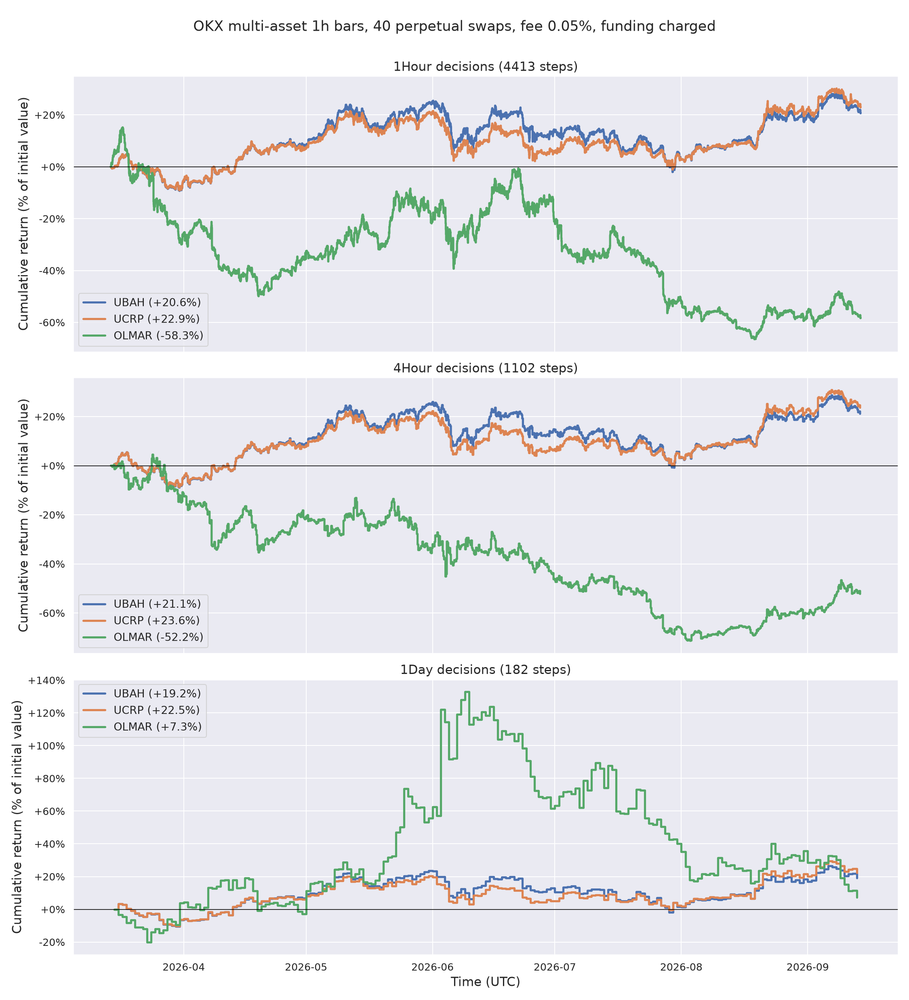

# Portfolio Environment

`PortfolioTradingEnv` allocates a portfolio across N assets and cash. The agent outputs target
weights, the env fills them at the close, values the book one bar later and charges fees and
funding. `N` is read from the data.

Two classes share one money function, `portfolio_step()`:

| Class | Use it for | Bookkeeping |
|---|---|---|
| `PortfolioTradingEnv` | evaluation, baselines, LLM actors | `history` with values, weights, costs and turnover per step |
| `VectorizedPortfolioTradingEnv` | training (steps `num_envs` lanes at once) | rewards only |

Their portfolio values match to 1e-9 on the same actions, so a policy trained on the
vectorized env is evaluated faithfully on the scalar one.

```python
from torchtrade.envs.offline import PortfolioTradingEnv, PortfolioTradingEnvConfig
from torchtrade.envs.offline.infrastructure.utils import load_portfolio_dataset

bars, instruments, funding = load_portfolio_dataset(revision="v2026.09")
config = PortfolioTradingEnvConfig(
    time_frames=["1Hour"], window_sizes=[50], execute_on="4Hour",
    transaction_fee=0.0005, allow_short=False,
)
env = PortfolioTradingEnv(bars, config, funding=funding)
```

## Data

`bars` is long format, one row per asset and bar: `timestamp` (UTC, bar open), `inst_id`,
`open`, `high`, `low`, `close`, `volume`, optional `tradable`. A missing row means the asset
was not tradable at that bar; its last close is carried forward. Rows that stop before the
end of the data mean the asset was delisted: the position is closed at its last tradable
close. `funding` (optional) has `timestamp`, `inst_id`, `funding_rate`. Non-finite prices or
rates are rejected.

## Action, observation, timing

**Action.** Target weights `[w_cash, w_1, ..., w_N]`. The env normalises any vector to
`w_cash + Σ|w_i| = 1` with `w_cash ≥ 0`, clips shorts unless `allow_short=True`, and caps
gross exposure at `max_gross` (≤ 1). Assets that are not tradable at the decision bar keep
their holding; the rest of the budget follows the requested proportions.

**Observation.** `portfolio_weights` (N+1, drifted weights, cash first), `tradable` (N),
and `market_data_{tf}_{window}` (N × window × 3: close, high, low divided by the window's
latest close; zero before an asset lists).

**Timing.** The agent observes bars up to and including n, the rebalance fills at close n,
and the step is valued at close n+1 with funding for settlements in (fill n, fill n+1].
A done env stepped before its reset re-emits its terminal transition with reward 0.

## Costs and assumptions

- A trade pays `transaction_fee × |notional traded|` (a perpetual swap's fee). The
  post-trade value solves `μ = 1 − fee·Σ|w'_i − μ·w_i|` exactly. `transaction_fee` defaults
  to 0; set your venue's taker rate.
- Zero slippage and zero market impact: every trade fills at the close and does not move it.
- Funding is charged on the weights at the end of the step, which is exact when settlements
  fall on `execute_on` boundaries.
- No leverage: gross exposure is at most 1, and an unlevered book cannot be liquidated.

## Baselines

Three baselines from the online portfolio selection literature live in `torchtrade.actor`.
Each is a callable `policy(td) -> td` that writes `td["action"]`, so it runs through
`env.rollout()` exactly like a trained policy, on either env.

| Baseline | Rule |
|---|---|
| `UBAH(max_gross=1.0)` | Uniform buy and hold: `max_gross`/N in each asset once it trades, then never rebalance |
| `UCRP()` | Uniform constant rebalanced portfolio: back to equal weights every step |
| `OLMAR(window=5, epsilon=10.0)` | On-line moving average reversion (Li & Hoi, 2012): bet on the window mean over the latest close |

```python
from torchtrade.actor import OLMAR, UBAH, UCRP
from torchtrade.metrics import portfolio_metrics

env.rollout(env.sampler.num_exec, policy=UCRP())
print(portfolio_metrics(env.history, periods_per_year=6 * 365))  # 4-hour bars
```

`examples/offline/portfolio_baselines.py` runs all three on `Torch-Trade/okx-multi-asset-1h`
(40 perpetual swaps, 2026-03-12 to 2026-09-13, 1h bars, initial cash 10,000) at 1h, 4h and
1d decisions, at OKX's regular-tier taker fee of 0.05% with funding charged. These are the
numbers an RL policy trained on this dataset has to beat, on the same window and frequency:

| decisions | baseline | final value | Sharpe | max drawdown | turnover | commission | funding |
|---|---|---|---|---|---|---|---|
| 1h | UBAH | 1.206 | 1.16 | −0.219 | 1.0 | 5 | 327 |
| 1h | UCRP | 1.229 | 1.31 | −0.186 | 16.3 | 89 | 285 |
| 1h | OLMAR | 0.417 | −1.14 | −0.709 | 5506 | 18,456 | 234 |
| 4h | UBAH | 1.211 | 1.22 | −0.213 | 1.0 | 5 | 328 |
| 4h | UCRP | 1.236 | 1.37 | −0.180 | 8.7 | 48 | 287 |
| 4h | OLMAR | 0.478 | −0.95 | −0.726 | 2004 | 6,187 | 211 |
| 1d | UBAH | 1.192 | 1.09 | −0.207 | 1.0 | 5 | 327 |
| 1d | UCRP | 1.225 | 1.29 | −0.172 | 4.5 | 24 | 285 |
| 1d | OLMAR | 1.073 | 0.62 | −0.540 | 337 | 2,339 | 386 |



What to read off this. UCRP beats UBAH on every frequency with a shallower drawdown: selling
what rose and buying what fell harvests the universe's volatility at a cost of a few dozen
USD in commission. Funding, not commission, is the dominant cost of holding this universe
(about 3% of initial value over six months). OLMAR turns the book over from 337x (1d) to
5,506x (1h); at zero fee it is the best strategy at 4h (1.30x), at the taker fee it loses
half the account at 1h and 4h and keeps +7% at 1d with a 54% drawdown. Equal weight is the
bar: a learned policy that does not beat UCRP after costs, on both final value and
drawdown, has not learned anything the market did not hand it. The dataset's selection bias
(below) lifts every one of these curves, and lifts a learned policy the same way.

## Metrics

`portfolio_metrics(history, periods_per_year)` returns the standard metrics of
[`compute_all_metrics`](../guides/metrics.md) (return, Sharpe, Sortino, Calmar, drawdown,
win rate) plus `final_value` (p_f / p_0) and the episode totals of `turnover`
(Σ|w_filled − w_drifted| over the assets, per step), `commission` and `funding`. The scalar
env's `history` also exposes each of these per step through `history.to_dict()`. Like every
offline env's history, it covers the current episode and starts over on `reset()`, so
evaluate over the whole timeline as one episode (`random_start=False`, no `max_traj_length`),
as the example does.

To compare your own policy, pass it to the same rollout:

```python
env.rollout(env.sampler.num_exec, policy=my_policy)
metrics = portfolio_metrics(env.history, periods_per_year=6 * 365)
```

## Dataset caveat

The 40 instruments in `Torch-Trade/okx-multi-asset-1h` were selected by liquidity measured
at the end of the window, so backtests over that window carry selection bias. Choose the
universe from data before the test window.
