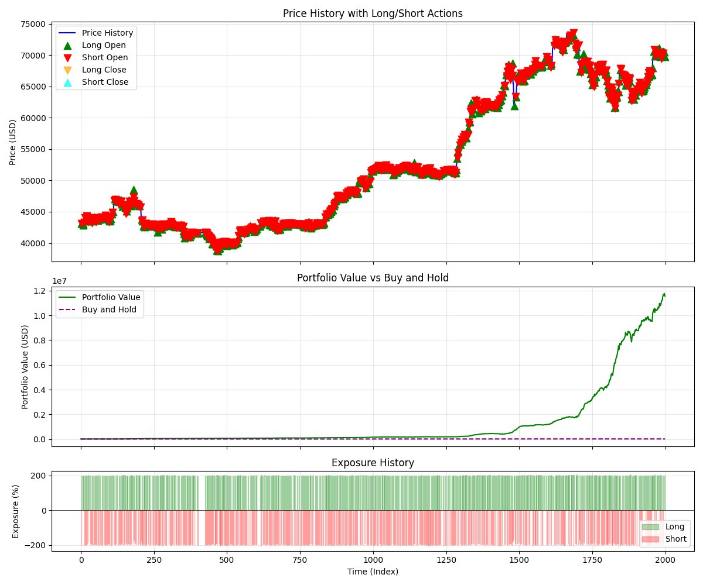
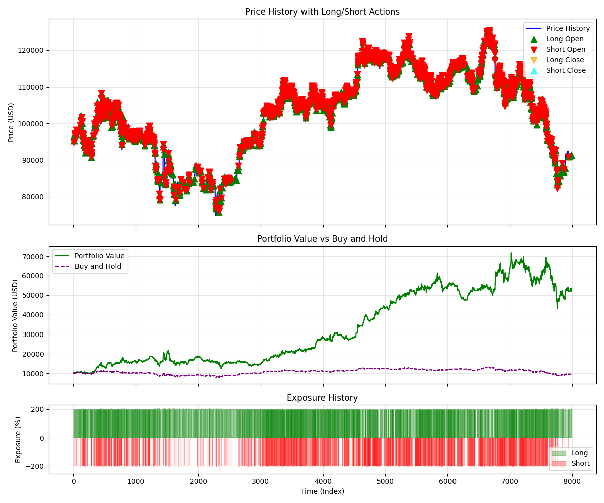

# Results

Example training results from TorchTrade's offline environments. These demonstrate what trained policies look like — not tuned benchmarks.

!!! warning "Not Benchmarks"
    These results use default hyperparameters and are **not optimized**. They serve as visual examples of what training output looks like, not as performance targets.

## DQN vs PPO — SequentialTradingEnv (Futures, 2x Leverage)

In this example we compare DQN and PPO on BTC/USD with 1Hour timeframe, `action_levels=[-1, 0, 1]`, `leverage=2`, and **no transaction fees** — purely to demonstrate general learning behavior. The shown results are not realistic and should not be taken as indicative of real trading performance. Note that without fees, policies typically overtrade since there is no cost to frequent position changes.

A common observation is **overfitting**: the policy learns to trade profitably on the training data but performance degrades on unseen test data. This is expected and highlights the importance of evaluating on held-out data and applying regularization techniques.

### Training Curves

### DQN Episode History

**Training Data:**

**Test Data** (not seen during training):

### PPO Episode History

**Training Data:**

**Test Data** (not seen during training):

